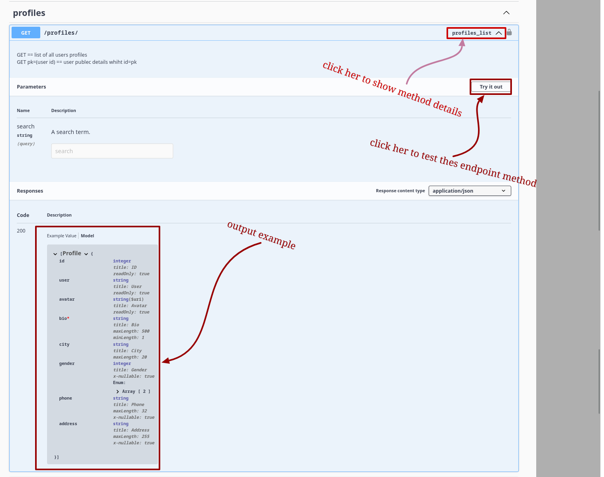

# Django User Profile

## Description


the best user-profile app using django rest framework 

## Table of Contents (Optional)

- [Installation](#installation)
- [Usage](#usage)
- [Documentation](#documentation)
- [License](#license)

## Installation

```shell
    git clone [repo-link]
    cd django-user-profile
```

## first way

### Requirement
```python3``` ```pip```

```bash
pip install -r requirements.txt
```

run

```shell
python manage.py runserver
```

## second way 

### Requirement

```docker``` and ```ansible-playbook```

run 

```shell
ansible-playbook playbook.yml
```

## Usage


Go to thes link ```http://localhost:8000/docs/``` to show project documentation


or for more details you can go to ```http://localhost:8000/redoc/```


## Documentation

</br>

### the firs view you can show all endpoints and models


### and you can show all allow methods for any endpoint 


### and if you want try example for this method



### finalle you can shwo any model details


## License

The source code used to format and display that content is licensed under the  [MIT license](LICENSE.md)